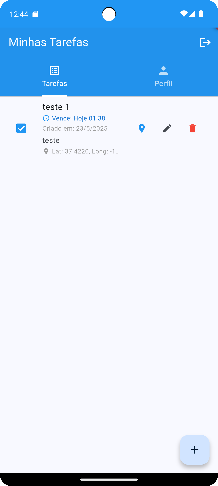
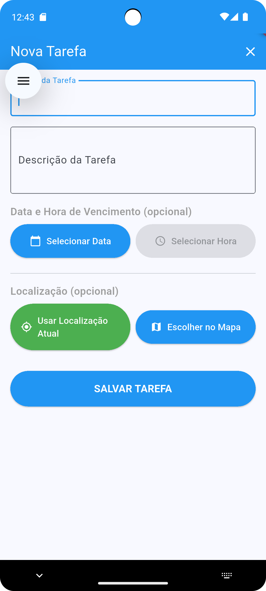
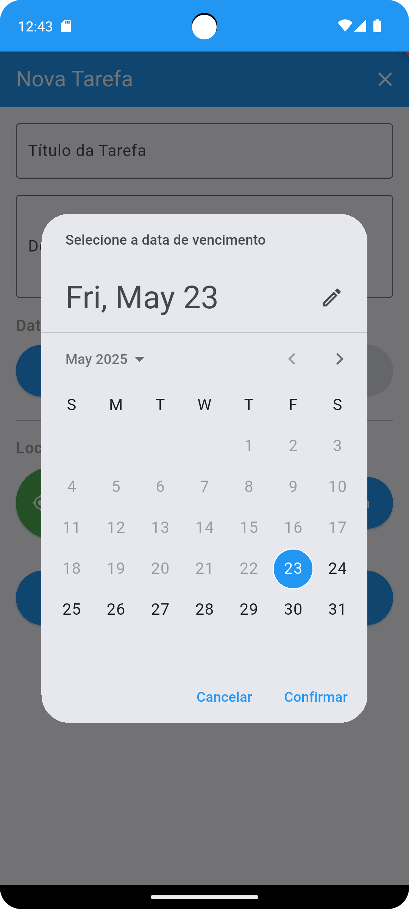
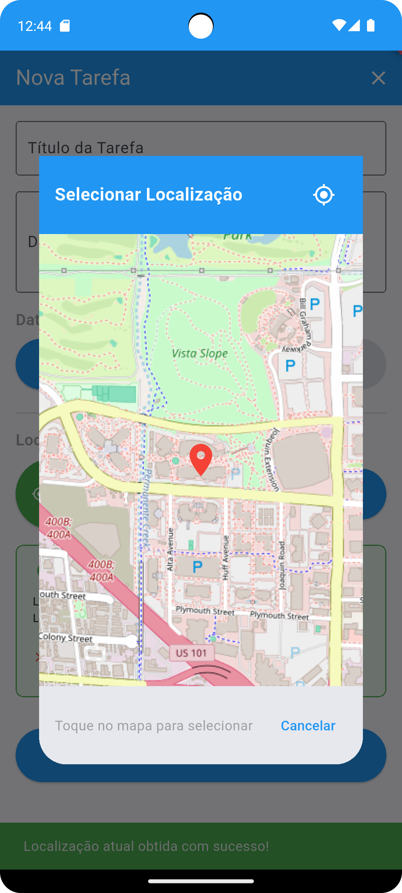
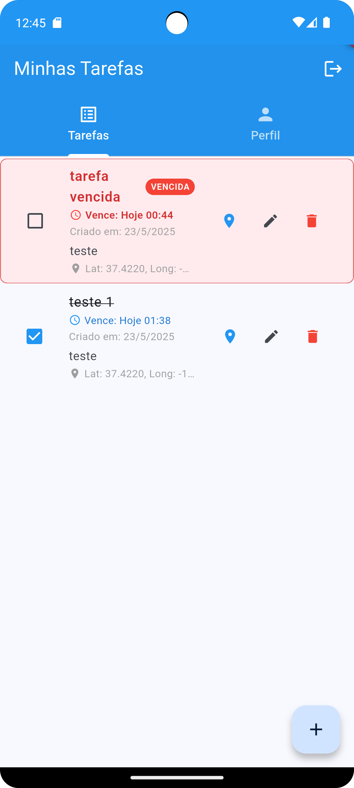

# 📋 App Lista de Tarefas Flutter

Um aplicativo moderno de gerenciamento de tarefas desenvolvido em Flutter, com funcionalidades avançadas de localização GPS, data/hora de vencimento e estado global gerenciado com Provider.

## 🚀 Funcionalidades Principais

### ✅ **Gerenciamento de Tarefas**
- ✅ Criar, editar e excluir tarefas
- ✅ Marcar tarefas como concluídas
- ✅ Sistema de datas e horários de vencimento
- ✅ Notificação visual de tarefas vencidas
- ✅ Ordenação inteligente (vencidas primeiro)

### 📍 **Localização GPS Nativa**
- 🗺️ Integração com GPS nativo do dispositivo
- 📱 Seleção de localização no mapa interativo
- 🎯 Botão "Usar Localização Atual" 
- 🔍 Visualização de localização das tarefas

### ⏰ **Gestão de Prazos**
- 📅 Seletor de data de vencimento
- 🕒 Seletor de horário específico
- 🚨 Destaque visual para tarefas vencidas
- 📊 Badge "VENCIDA" para tarefas em atraso

### 👤 **Sistema de Usuários**
- 🔐 Login e logout de usuários
- 👥 Perfil de usuário personalizado
- 💾 Dados persistidos localmente (SharedPreferences)

## 🛠️ Tecnologias Utilizadas

- **Flutter** - Framework de desenvolvimento mobile
- **Provider** - Gerenciamento de estado global
- **flutter_map** - Mapas interativos
- **geolocator** - Localização GPS nativa
- **permission_handler** - Gerenciamento de permissões
- **shared_preferences** - Armazenamento local
- **uuid** - Geração de IDs únicos

## 📱 Screenshots

### Tela de Login
<!-- Adicione aqui uma screenshot da tela de login -->


### Lista de Tarefas
<!-- Adicione aqui uma screenshot da lista de tarefas -->


### Adição de Nova Tarefa
<!-- Adicione aqui uma screenshot do formulário de nova tarefa -->


### Seleção de Data e Hora
<!-- Adicione aqui uma screenshot dos seletores de data/hora -->


### Seleção de Localização
<!-- Adicione aqui uma screenshot do mapa de localização -->


### Tarefas Vencidas
<!-- Adicione aqui uma screenshot mostrando tarefas vencidas -->


## 🏗️ Arquitetura do Projeto

```
lib/
├── models/
│   ├── todo.dart              # Modelo de dados da tarefa
│   └── user.dart              # Modelo de dados do usuário
├── providers/
│   └── todo_provider.dart     # Estado global com Provider
├── services/
│   ├── auth_service.dart      # Serviço de autenticação
│   ├── todo_service.dart      # Serviço de tarefas
│   └── location_service.dart  # Serviço de localização GPS
├── screens/
│   ├── login_screen.dart      # Tela de login
│   ├── home_screen.dart       # Tela principal
│   └── profile_screen.dart    # Tela de perfil
├── widgets/
│   ├── add_todo_form.dart     # Formulário de nova tarefa
│   ├── todo_item.dart         # Item da lista de tarefas
│   └── edit_todo_dialog.dart  # Dialog de edição
└── main.dart                  # Arquivo principal
```

## 🚀 Como Executar o Projeto

### Pré-requisitos
- Flutter SDK (versão 3.0 ou superior)
- Android Studio / VS Code
- Emulador Android ou dispositivo físico

### Passos para execução

1. **Clone o repositório**
```bash
git clone https://github.com/jfsts/flutterinfnet.git
cd flutterinfnet
```

2. **Instale as dependências**
```bash
flutter pub get
```

3. **Execute o aplicativo**
```bash
flutter run
```

### Permissões necessárias

O app requer as seguintes permissões no Android:

```xml
<uses-permission android:name="android.permission.ACCESS_FINE_LOCATION" />
<uses-permission android:name="android.permission.ACCESS_COARSE_LOCATION" />
<uses-permission android:name="android.permission.INTERNET" />
```

## 🎯 Funcionalidades Detalhadas

### 📋 **Criação de Tarefas**
- **Título obrigatório** e descrição opcional
- **Data de vencimento** selecionável (opcional)
- **Horário específico** para maior precisão
- **Localização GPS** através do mapa ou localização atual
- **Validação** de campos obrigatórios

### 📅 **Sistema de Vencimentos**
- **Formatação inteligente**: "Hoje", "Amanhã", "DD/MM"
- **Ordenação automática**: Tarefas vencidas aparecem primeiro
- **Indicadores visuais**: Bordas vermelhas e badges para tarefas vencidas
- **Status dinâmico**: Verifica automaticamente se está vencida

### 🗺️ **Integração com Mapas**
- **Mapa interativo** usando OpenStreetMap
- **Marcador visual** da localização selecionada
- **Botão GPS** para usar localização atual
- **Visualização** da localização das tarefas existentes

### 🔄 **Estado Global**
- **Provider pattern** para gerenciamento de estado
- **Sincronização automática** entre telas
- **Loading states** e tratamento de erros
- **Persistência local** dos dados

## 🎨 **Design e UX**

### Interface Moderna
- ✅ Material Design 3
- ✅ Cores harmoniosas (azul como cor primária)
- ✅ Ícones intuitivos
- ✅ Feedback visual em todas as ações

### Experiência do Usuário
- ✅ Loading indicators durante operações
- ✅ Mensagens de erro amigáveis
- ✅ Confirmações para ações destrutivas
- ✅ Navegação intuitiva com tabs
- ✅ Pull-to-refresh na lista

## 📊 **Ordenação e Filtros**

### Sistema de Priorização
1. **Tarefas vencidas não concluídas** (prioridade máxima)
2. **Tarefas com vencimento próximo**
3. **Tarefas sem vencimento**
4. **Tarefas concluídas** (final da lista)

### Critérios de Ordenação
- Status de conclusão
- Data e hora de vencimento
- Data de criação (mais recentes primeiro)

## 🔧 **Melhorias Futuras**

- [ ] Notificações push para lembretes
- [ ] Categorização de tarefas
- [ ] Modo escuro/claro
- [ ] Sincronização na nuvem
- [ ] Relatórios de produtividade
- [ ] Integração com calendário
- [ ] Subtarefas/checklist
- [ ] Compartilhamento de tarefas

## 👨‍💻 **Desenvolvimento**

### Padrões Utilizados
- **Provider Pattern** para estado global
- **Service Layer** para lógica de negócio
- **Separation of Concerns** na estrutura de pastas
- **Error Handling** robusto
- **Responsive Design** para diferentes telas

### Testes
```bash
# Executar testes
flutter test

# Análise de código
flutter analyze
```

## 📄 **Licença**

Este projeto está licenciado sob a MIT License - veja o arquivo [LICENSE](LICENSE) para detalhes.

## 🤝 **Contribuição**

Contribuições são bem-vindas! Para contribuir:

1. Faça um Fork do projeto
2. Crie uma branch para sua feature (`git checkout -b feature/AmazingFeature`)
3. Commit suas mudanças (`git commit -m 'Add some AmazingFeature'`)
4. Push para a branch (`git push origin feature/AmazingFeature`)
5. Abra um Pull Request

## 📞 **Contato**

**Desenvolvedor**: Seu Nome  
**Email**: seu.email@exemplo.com  
**LinkedIn**: [Seu LinkedIn](https://linkedin.com/in/seu-perfil)  
**GitHub**: [jfsts](https://github.com/jfsts)

---

⭐ **Se este projeto foi útil para você, deixe uma estrela no repositório!**

---

**Desenvolvido com ❤️ usando Flutter**
